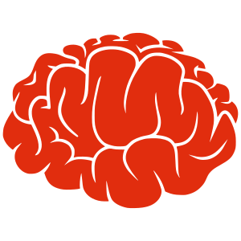

# CORnet: Modeling the Neural Mechanisms of Core Object Recognition

## What is this?

A family of simple yet powerful deep neural networks for visual neuroscience. What makes CORnets useful:

- Simple
- Lightweight
- Recurrent
- State-of-the-art on predicting primate neural and behavioral responses [Brain-Score](http://brain-score.org)

[read more...](#longer-motivation)

*Brought to you with  from [DiCarlo Lab](http://dicarlolab.mit.edu) @ [MIT](https://mit.edu).*


## Available Models

*(Click on model names to download the weights of ImageNet-trained models. Note that you do not need to download the weights manually: we use [PyTorch Model Zoo](https://pytorch.org/docs/stable/model_zoo.html#torch.utils.model_zoo.load_url) to download the weights automatically.)*

| Name     | Description                                                              |
| -------- | ------------------------------------------------------------------------ |
| [CORnet-Z](https://s3.amazonaws.com/cornet-models/cornet_z-5c427c9c.pth) | Our smallest, fastest model. Good neural fits                            |
| [CORnet-RT](https://s3.amazonaws.com/cornet-models/cornet_rt-933c001c.pth) | Recurrent version of CORnet-Z. Better than CORnet-Z + recurrent but slow |
| [CORnet-S](https://s3.amazonaws.com/cornet-models/cornet_s-1d3f7974.pth) | CORnet-R with ResNet-like blocks. Best overall but slow to train         |


*Note:* In the past, we provided a model called
[CORnet-R](https://s3.amazonaws.com/cornet-models/cornet_r-5930a990.pth). However, we found out that CORnet-R was not doing a biological temporal unrolling as described in the [pre-print](#Citation) (Fig. 2, right). Instead, it was performing a non-biological unrolling (Fig. 2, left). We therefore issued a corrected version of the model but in order to avoid confusion, we labeled the biologically-unrolled version as CORnet-RT (that is, CORnet-RT is what is labeled in the pre-print as CORnet-R). We encourage to use CORnet-RT instead of CORnet-R, which is only provided as a legacy version in case you were already running experiments on it. In our experiments, we did not see major differences between the two models.


## Quick Start

### Want to test on your own images?

`python run.py test --model S --data_path <path to your image folder> --output_path <path where you want output features saved>`

Model weights will be automatically downloaded and restored.

Add `-o <path to save features>` if you want model responses to be saved someplace.

Add `--ngpus 1` if you want to run this on a GPU.

### Want to train on ImageNet?

1. You need one or two GPUs. We used Titan X, nowadays a popular choice is GeForce GTX 1080 Ti or GeForce RTX 2080 Ti.

2. [Get ImageNet](https://github.com/facebook/fb.resnet.torch/blob/master/INSTALL.md#download-the-imagenet-dataset) if you don't have it yet. If you do, note that validation images need to be put in separate folders, just like train data. Follow the instructions in that link to do so easily.

3. You are ready to train:

  - CORnet-Z: `python run.py train --model Z --workers 20 --ngpus 1 --step_size 10 --epochs 25 --lr .01 --data_path <path to imagenet> --output_path <path to saving trained model>` (~20 hours)
  - CORnet-RT: `python run.py train --model RT --workers 20 --ngpus 2 --step_size 10 --epochs 25 --lr .1 --data_path <path to imagenet> --output_path <path to saving trained model>`
  - CORnet-S: `python run.py train --model S --workers 20 --ngpus 2 --step_size 20 --epochs 43 --lr .1 --data_path <path to imagenet> --output_path <path to saving trained model>` (several days)

### If installation is needed

`pip install git+https://github.com/dicarlolab/CORnet`


# Details

## Longer Motivation

Deep artificial neural networks with spatially repeated processing (aka, deep convolutional ANNs) have been established as the best class of candidate models of visual processing in primate ventral visual processing stream. Over the past five years, these ANNs have evolved from a simple feedforward eight-layer architecture in AlexNet to extremely deep and branching NASNet architectures, demonstrating increasingly better object categorization performance and increasingly better explanatory power of both neural and behavioral responses. However, from the neuroscientist's point of view, the relationship between such very deep architectures and the ventral visual pathway is incomplete in at least two ways. On one hand, current state-of-the-art ANNs appear to be too complex (e.g. now over 100 levels) compared with the relatively shallow cortical hierarchy (4-8 levels), which makes it difficult to map their elements to those in the ventral visual stream and makes it difficult to understand what they are doing. On the other hand, current state-of-the-art ANNs appear to be not complex enough in that they lack recurrent connections and the resulting neural response dynamics that are commonplace in the ventral visual stream. Here we describe our ongoing efforts to resolve both of these issues by developing a "CORnet" family of deep neural network architectures. Rather than just seeking high object recognition performance (as the state-of-the-art ANNs above), we instead try to reduce the model family to its most important elements (CORnet-Z) and then gradually build new ANNs with recurrent and skip connections while monitoring both performance and the match between each new CORnet model and a large body of primate brain and behavioral data. We report here that our current best ANN model derived from this approach (CORnet-S) is among the top models on Brain-Score, a composite benchmark for comparing models to the brain, but is simpler than other deep ANNs in terms of the number of convolutions performed along the longest path of information processing in the model. All CORnet models are available at [github.com/dicarlolab/CORnet](github.com/dicarlolab/CORnet), and we plan to update this manuscript and the available models in this family as they are produced.

Read more: [Kubilius\*, Schrimpf\*, et al. (NeurIPS, 2019)](http://papers.nips.cc/paper/9441-brain-like-object-recognition-with-high-performing-shallow-recurrent-anns)


## Requirements

- Python 3.6+
- PyTorch 0.4.1+
- numpy
- pandas
- tqdm
- fire


## License

GNU GPL 3+


# FAQ

- Is CORnet-S *the* model of vision?

No. This is a constant work in progress. We display here our best current models for core object recognition but these models are constantly evolving.

- Why not "CoreNet"?

COR = Core Object Recognition. Also, CORnet has a nice connection to "cortex".

- My model is better than CORnet. Can I place it in this repository?

Exciting. Find a nice name for it and submit it to [Brain-Score.org](http://brain-score.org). This repository is only for CORnet family of models, while Brain-Score is a great place to show your model to the world and link to its own repository.

- Are hyperparameters arbitrary?

No. We tried many architectures and these are the ones that worked best. However, an exhaustive search has not been done. Simpler yet equally good models might exist, as well as more complicated but more predictive models.

- Why do you use classes for defining everything? Aren't functions enough?

Classes allow packaging functions into a single object, providing a good code organization.


# Citation

For CORnet-S:

Kubilius, J., Schrimpf, M., Kar, K., Rajalingham, R., Hong, H., Majaj, N., ... & Dicarlo, J. (2019). Brain-like object recognition with high-performing shallow recurrent ANNs. In *Advances in Neural Information Processing Systems* (pp. 12785-12796).

```
@inproceedings{KubiliusSchrimpf2019CORnet,
abstract = {Deep convolutional artificial neural networks (ANNs) are the leading class of candidate models of the mechanisms of visual processing in the primate ventral stream. While initially inspired by brain anatomy, over the past years, these ANNs have evolved from a simple eight-layer architecture in AlexNet to extremely deep and branching architectures, demonstrating increasingly better object categorization performance, yet bringing into question how brain-like they still are. In particular, typical deep models from the machine learning community are often hard to map onto the brain's anatomy due to their vast number of layers and missing biologically-important connections, such as recurrence. Here we demonstrate that better anatomical alignment to the brain and high performance on machine learning as well as neuroscience measures do not have to be in contradiction. We developed CORnet-S, a shallow ANN with four anatomically mapped areas and recurrent connectivity, guided by Brain-Score, a new large-scale composite of neural and behavioral benchmarks for quantifying the functional fidelity of models of the primate ventral visual stream. Despite being significantly shallower than most models, CORnet-S is the top model on Brain-Score and outperforms similarly compact models on ImageNet. Moreover, our extensive analyses of CORnet-S circuitry variants reveal that recurrence is the main predictive factor of both Brain-Score and ImageNet top-1 performance. Finally, we report that the temporal evolution of the CORnet-S "IT" neural population resembles the actual monkey IT population dynamics. Taken together, these results establish CORnet-S, a compact, recurrent ANN, as the current best model of the primate ventral visual stream.},
archivePrefix = {arXiv},
arxivId = {1909.06161},
author = {Kubilius, Jonas and Schrimpf, Martin and Hong, Ha and Majaj, Najib J. and Rajalingham, Rishi and Issa, Elias B. and Kar, Kohitij and Bashivan, Pouya and Prescott-Roy, Jonathan and Schmidt, Kailyn and Nayebi, Aran and Bear, Daniel and Yamins, Daniel L. K. and DiCarlo, James J.},
booktitle = {Neural Information Processing Systems (NeurIPS)},
editor = {Wallach, H. and Larochelle, H. and Beygelzimer, A. and D'Alch{\'{e}}-Buc, F. and Fox, E. and Garnett, R.},
pages = {12785----12796},
publisher = {Curran Associates, Inc.},
title = {{Brain-Like Object Recognition with High-Performing Shallow Recurrent ANNs}},
url = {http://papers.nips.cc/paper/9441-brain-like-object-recognition-with-high-performing-shallow-recurrent-anns},
year = {2019}
}
```

For CORnet-Z and CORnet-RT:

Kubilius, J., Schrimpf, M., Nayebi, A., Bear, D., Yamins, D.L.K., DiCarlo, J.J. (2018) CORnet: Modeling the Neural Mechanisms of Core Object Recognition. *biorxiv.* doi:10.1101/408385

